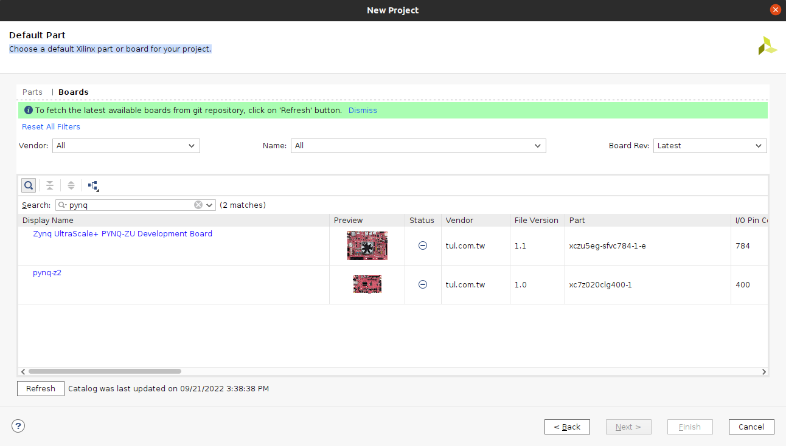
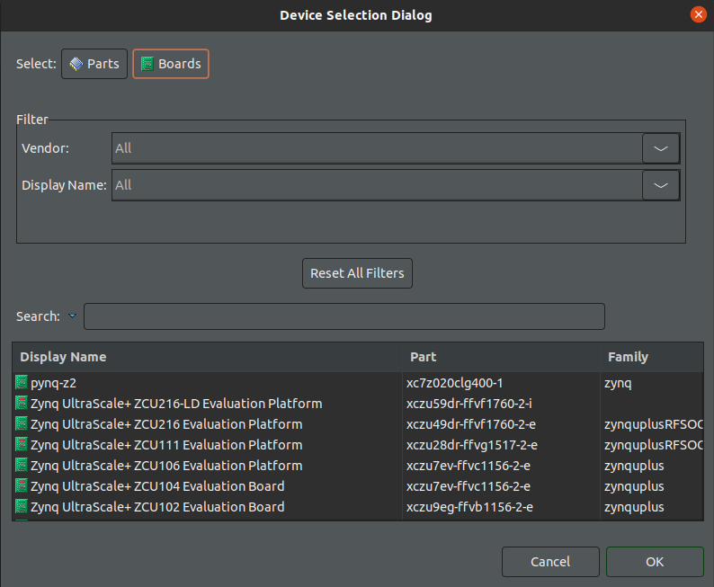
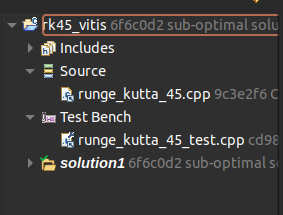

# Title

Description

## System Used

- Linux Ubuntu 20.04 LTS
- Vivado ML edition 2022.1
- Others

## Vivado Installation

### Requirements
- Manually install `libtinfo5` and `libncurses5` before installing Vivado or it gets stuck in the final processing: https://support.xilinx.com/s/question/0D54U00005astbhSAA/vivado-gets-stuck-or-takes-more-than-1-to-15-days-in-final-processing-ie-generating-installed-device-list-when-trying-to-install-in-ubuntu-2204?language=en_US
- Manually install g++ and gcc compilers: `sudo apt install g++`
- Manually install make, otherwise the simulation does not work: `sudo apt install make`

### Installation
Access the [downloads](https://www.xilinx.com/support/download/index.html/content/xilinx/en/downloadNav/vivado-design-tools/2022-1.html) link for Vivado 2022.1, and download the Xilinx Unified Installer. It will ask to create an account or sign in, and it will then ask to input your information. After downloading the installer, launch it with sudo privilege, in order to be able to access the folder `/opt`, which is usually used for installation:

```
chmod +x Xilinx_Unified_2022.1_0420_0327_Lin64.bin
sudo ./Xilinx_Unified_2022.1_0420_0327_Lin64.bin
```

It is not necessary to install the whole Vitis software, because in this thesis only Vitis HLS and Vivado have been used. Under my system, I selected the installation directory `/opt/Xilinx`, but it can be modified as the user prefers.

WARNING: The installation will require some hundreds of GB and a lot of time, it is therefore important to check if all the [`Requirements`](https://github.com/davide-giacomini/runge_kutta_45#requirements) are met. Moreover, if the internet connection is not enough stable, the installation may get stuck and the software may need to be installed again from scratch.

I had in my system the license for `Vivado ML Enterprise Edition`, but the Zynq XC7Z020, which is the [PYNQ-Z2](https://www.xilinx.com/support/university/xup-boards/XUPPYNQ-Z2.html#hardware), should be supported by the `Vivado ML Standard Edition` too. More information at page 8 of the [Release Notes](https://docs.xilinx.com/r/en-US/ug973-vivado-release-notes-install-license/Supported-Devices).

## Importing Board PYNQ-Z2
When creating a new project in Vivado, the software asks to *"Choose a default Xilinx part or board for your project"*. The board PYNQ-Z2 should appear among the choices, as in here:
<p align="center">
    
</p>

If it does not, as happened to me, there is an option to import manually import the board. I followed [this guide](https://community.element14.com/technologies/fpga-group/b/blog/posts/add-pynq-z2-board-to-vivado), using the deprecated option (putting the files in the Vivado boards folder) because it had already worked for me once.

## Synthesizing The Project With Vivado

### Vitis HLS Synthesis and IP Generation
I uploaded in GitHub also the configuration files of Vitis HLS and Vivado mostly to save the results that I was getting, but it is very unlikely that the project is supported cross-platform as it is. To manually run the HLS Synthesis and the IP Generation in Vitis HLS, it is necessary to follow the steps below:
- Create a new Project: in the `Part Selection`, just click on `Boards` and choose the PYNQ-Z2. Don't worry about the solution name or clock period, you can change these options. The `FLow Target` has to be set to `Vivado IP Flow Target`, which is the flow designed to manually import the generated IP in Vivado.
- A window will appear with the source and test bench to add. You can right-click on both and add the source file [`src/runge_kutta_45.cpp`](src/runge_kutta_45.cpp) and the test bench [`src/runge_kutta_45_test.cpp`](src/runge_kutta_45_test.cpp).
- Right clicking on the root folder of the project, navigate to `Synthesis` and browse the Top Function, which is in this case `runge_kutta_45`.
- Now you can run the simulation, synthesis and cosimulation. Being the data too big, it could be necessary to skip the cosimulation for timing purposes. Lastly, you can export the RTL.

<div style="display: flex;">
  <div style="flex: 29%;">
    <p align="center">
        
    </p>
  </div>
  <div style="flex: 19%;">
    <p align="center">
        
    </p>
  </div>
  <div style="flex: 49%;">
    <p align="center">
        
    </p>
  </div>
</div>

### Vivado Synthesis and Bitstream Generation
The IP is generated in the folder  `<vitis_root>/<solution_name>/impl/ip`, which in my case is [`rk45_vitis/solution1/impl/ip`](rk45_vitis/solution1/impl/ip).


# Troubleshooting
### Vivado bugs
- The "ap_int.h" was bugged: https://support.xilinx.com/s/question/0D52E00006lLgn7SAC/vitishls-20201-debugger-doesnt-start?language=en_US. Probably the gdb option was conflicting with something.
- For the cosimulation working, in my system I did: https://support.xilinx.com/s/article/Use-of-gmp-h-for-Co-simulation?language=en_US. This is ONLY FOR 2021.x, it seems so... Anyway, just be aware of it. Also, if I add `gmp.h` manually, I have to install `sudo apt install libgmp3-dev`: https://stackoverflow.com/questions/7351205/where-to-find-gmp-h