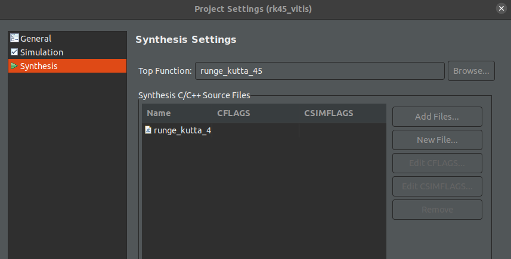

# Enhancing Onboard Orbit Propagation: A Deep Dive into FPGA Capabilities

## Abstract
Deep-space missions heavily rely on ground stations and human involvement to deter- mine the spacecraft position via radiometric tracking and plan the maneuvers execution to allow the satellite to reach its target orbit. These operations are usually defined as Guidance, Navigation, and Control (GNC). However, this traditional approach presents scalability challenges as the number of deep-space assets increases rapidly. The delays and costs associated with ground control became overwhelming, necessitating a shift towards autonomous GNC operations, where the operations are performed directly on board, hence limiting the need for communications with ground and hence mission costs. In the realm of space exploration and deep-space missions, where precise trajectory predictions are essential, the ability to propagate an object’s orbit quickly and accurately becomes indispensable. Rapid and reliable orbit propagation is key for performing precise orbit determination and to predict the spacecraft future trajectory, aiding in navigation and ensuring mission success. Power efficiency is also a vital consideration in space missions, where resources are often scarce. Optimizing the orbit propagation process to consume minimal power is fundamental as the available power is limited and hence an efficient utilization of onboard resources is mandatory. Efforts are therefore focused on developing specialized hardware, such as Field-Programmable Gate Arrays (FPGAs), that can effi- ciently handle the demanding computations involved in orbit propagation. FPGAs offer the potential for high-speed processing with reduced power consumption, making them well-suited for onboard satellite computing. This thesis uses the PYNQ-Z2 as a showcase to explore the possibilities of orbit propagation acceleration onto FPGAs. Different orbit scenario are analyzed, to validate and estimate the performance of FPGA-based orbit propagation, showing a gain of 76% wrt to CPU-based computation.

## Description
This repository on GitHub contains the culmination of my efforts during the pursuit of a Master of Science degree in Computer Science and Engineering at the Polytechnic University of Milan. The primary objective of this thesis was to showcase the remarkable capabilities of Field-Programmable Gate Arrays (FPGAs) in the domain of Onboard Orbit Propagation.

For the Orbit Propagation algorithm, Runge-Kutta 5(4)7M [[1]](#1) has been used. It has been implemented in C++ and HLS C, respectively in the test bench [`src/runge_kutta_45_test.cpp`](src/runge_kutta_45_test.cpp) and in the source file [`src/runge_kutta_45.cpp`](src/runge_kutta_45.cpp). An IP has been later on generated from the HLS C implementation for further hardware design. More detailed information can be found in my [thesis](manuscript/Thesis.pdf).

## Project Structure
- Under the [`jupyter`](jupyter/) folder you can find the Jupyter Notebook script `.ipynb` for FPGA implementation, the bitstream `.bit` and the constraints file `.hwh`.
- Under the [`matlab`](matlab/) folder there are several scripts used to compare my implementation with analytical solutions and already tested implementations of Runge-Kutta.
- The folders [`rk45_vitis`](rk45_vitis) and [`rk45_vivado`](rk45_vivado) are the root folders for the Vitis HLS and Vivado projects.
- Under [`src`](src) there is:
    - A constant `json` file with all the different trajectories, from which the data is taken
    - A folder with all the headers files grouped together
    - Some orbits data saved under csv format for visual comparison
    - Some python scripts used to implement the algorithm and to run matlab scripts within it.
    - Finally, the actual source file `*.cpp` and test bench `*_test.cpp`.
    
WARNING: For the Makefile to compile everything without errors, Vivado must be installed (some of its libraries are needed), and an environmental variable `XILINX_HLS` must be set. In my system this variable represents:
```
printenv XILINX_HLS
/opt/Xilinx/Vitis_HLS/2022.1
```

## Software And System Used

- Linux Ubuntu 20.04 LTS
- Vivado ML edition 2022.1
- [PYNQ-Z2 Board](https://www.xilinx.com/support/university/xup-boards/XUPPYNQ-Z2.html#overview)

## Vivado Installation

### Requirements
- Manually install `libtinfo5` and `libncurses5` before installing Vivado or it gets stuck in the final processing: https://support.xilinx.com/s/question/0D54U00005astbhSAA/vivado-gets-stuck-or-takes-more-than-1-to-15-days-in-final-processing-ie-generating-installed-device-list-when-trying-to-install-in-ubuntu-2204?language=en_US
- Manually install g++ and gcc compilers: `sudo apt install g++`
- Manually install make, otherwise the simulation does not work: `sudo apt install make`

### Installation
Access the [downloads](https://www.xilinx.com/support/download/index.html/content/xilinx/en/downloadNav/vivado-design-tools/2022-1.html) link for Vivado 2022.1, and download the Xilinx Unified Installer. It will ask to create an account or sign in, and it will then ask to input your information. After downloading the installer, launch it with sudo privilege, in order to be able to access the folder `/opt`, which is usually used for installation:

```
chmod +x Xilinx_Unified_2022.1_0420_0327_Lin64.bin
sudo ./Xilinx_Unified_2022.1_0420_0327_Lin64.bin
```

It is not necessary to install the whole Vitis software, because in this thesis only Vitis HLS and Vivado have been used. Under my system, I selected the installation directory `/opt/Xilinx`, but it can be modified as the user prefers.

WARNING: The installation will require some hundreds of GB and a lot of time, it is therefore important to check if all the [`Requirements`](https://github.com/davide-giacomini/runge_kutta_45#requirements) are met. Moreover, if the internet connection is not enough stable, the installation may get stuck and the software may need to be installed again from scratch.

I had in my system the license for `Vivado ML Enterprise Edition`, but the Zynq XC7Z020, which is the [PYNQ-Z2](https://www.xilinx.com/support/university/xup-boards/XUPPYNQ-Z2.html#hardware), should be supported by the `Vivado ML Standard Edition` too. More information at page 8 of the [Release Notes](https://docs.xilinx.com/r/en-US/ug973-vivado-release-notes-install-license/Supported-Devices).

## Importing Board PYNQ-Z2
When creating a new project in Vivado, the software asks to *"Choose a default Xilinx part or board for your project"*. The board PYNQ-Z2 should appear among the choices, as in here:
<p align="center">
    
</p>

If it does not, as happened to me, there is an option to import manually import the board. I followed [this guide](https://community.element14.com/technologies/fpga-group/b/blog/posts/add-pynq-z2-board-to-vivado), using the deprecated option (putting the files in the Vivado boards folder) because it had already worked for me once.

## Synthesizing The Project With Vivado

### Vitis HLS Synthesis and IP Generation
I uploaded in GitHub also the configuration files of Vitis HLS and Vivado mostly to save the results that I was getting, but it is very unlikely that the project is supported cross-platform as it is. To manually run the HLS Synthesis and the IP Generation in Vitis HLS, it is necessary to follow the steps below:
- Create a new Project: in the `Part Selection`, just click on `Boards` and choose the PYNQ-Z2. Don't worry about the solution name or clock period, you can change these options. The `FLow Target` has to be set to `Vivado IP Flow Target`, which is the flow designed to manually import the generated IP in Vivado.
<p align="center">
    
</p>

- A window will appear with the source and test bench to add. You can right-click on both and add the source file [`src/runge_kutta_45.cpp`](src/runge_kutta_45.cpp) and the test bench [`src/runge_kutta_45_test.cpp`](src/runge_kutta_45_test.cpp).
<p align="center">
    
</p>

- Right clicking on the root folder of the project, navigate to `Synthesis` and browse the Top Function, which is in this case `runge_kutta_45`.
<p align="center">
    
</p>


- Now you can run the simulation, synthesis and cosimulation. Being the data too big, it could be necessary to skip the cosimulation for timing purposes. Lastly, you can export the RTL.

### Vivado Synthesis and Bitstream Generation
The IP is generated in the folder  `<vitis_root>/<solution_name>/impl/ip`, which in my case is [`rk45_vitis/solution1/impl/ip`](rk45_vitis/solution1/impl/ip).

The PYNQ-Z2 board can easily be programmed by integrating several Overlays (or IPs) using the Vivado Block Diagram in the Vivado IDE. To import the IP generated in the previous step, just click on `Settings` under `PROJECT MANAGER`, Navigate to `Project Settings -> IP -> Repository` and click on `+`. Navigate to the folder `ip` previously mentioned and click `Select`. The software should automatically detect the IP block and show it to you through a pop-up window.

<p align="center">
    
</p>

After integrating the IP block, click on `Create Block Design`. You can add the IP blocks through the `+`, or `Add IP` after right-clicking, and then you can connect them together. The final result should look like this:

<p align="center">
    
</p>

More information about recreating my project can be found in [my thesis](manuscript/Thesis.pdf).

After integrating the block design, you can run the synthesis, the implementation and finally generate the bitstream, which will be used as an overlay.

### PYNQ-Z2 Computation
At [`jupyter/runge_kutta_45.ipynb`](jupyter/runge_kutta_45.ipynb) there is a Jupyter Notebook script I have written in Python to test the difference between the Python implementation and the FPGA implementation.

In order for the bitstream to be implemented as an Overlay, it has to be imported along with the constraints file `.hwh`. Under the Vivado project root folder, these two files can be found in these paths:
- `<vivado project name>/<vivado project name>.gen/sources_1/bd/design_1/hw_handoff/design_1.hwh`
- `<vivado project name>/<vivado project name>.runs/impl_1/design_1_wrapper.bit`

WARNING: the paths may change with the version of Vivado.

In my case, I have saved everything under the same folder in this Git project: [`jupyer`](jupyter/). More detailed information on how to integrate Python programmability with this board can be found in [my thesis](manuscript/Thesis.pdf). At `Section 4.10`, and in [this tutorial](https://pynq.readthedocs.io/en/v3.0.0/getting_started.html), which is extremely well done. Here you can also find information on how to start the board for the first time.

# Troubleshooting
### Vivado bugs
- The "ap_int.h" was bugged: https://support.xilinx.com/s/question/0D52E00006lLgn7SAC/vitishls-20201-debugger-doesnt-start?language=en_US. Probably the gdb option was conflicting with something.
- For the cosimulation working, in my system I did: https://support.xilinx.com/s/article/Use-of-gmp-h-for-Co-simulation?language=en_US. This is ONLY FOR 2021.x, it seems so... Anyway, just be aware of it. Also, if I add `gmp.h` manually, I have to install `sudo apt install libgmp3-dev`: https://stackoverflow.com/questions/7351205/where-to-find-gmp-h

## Author

- Davide Giacomini ([GitHub](https://github.com/davide-giacomini), [Linkedin](https://www.linkedin.com/in/davide-giacomini/), [email](mailto://giacomini.davide@outlook.com))

## References

<a id="1">[1]</a> 
J. Dormand and P. Prince. A family of embedded runge-kutta formulae. Journal of Computational and Applied Mathematics, 6(1):19–26, 1980. ISSN 0377- 0427. doi: https://doi.org/10.1016/0771-050X(80)90013-3. URL https://www.sciencedirect.com/science/article/pii/0771050X80900133.